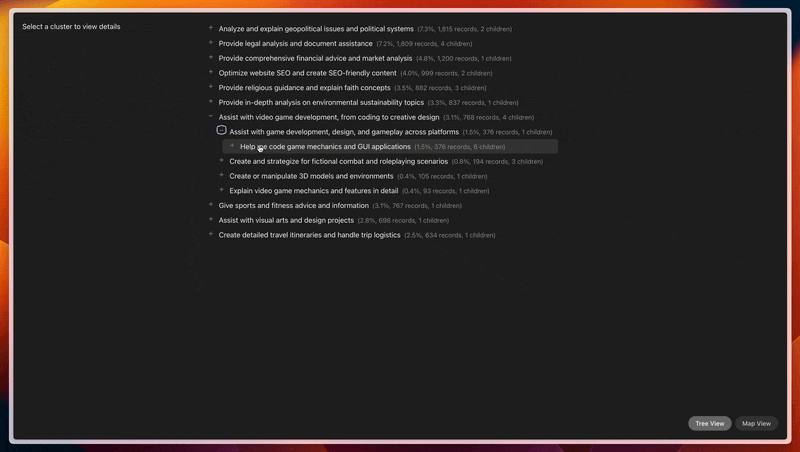

# OpenClio 🔍

An open source implementation of Anthropic's [Clio system](https://arxiv.org/abs/2412.13678) for privacy-preserving analysis of AI interactions.


## Overview



OpenClio helps you analyze large collections of AI conversations while preserving user privacy. It:

1. 🔍 Extracts key facets from conversations (tasks, requests, etc.)
2. 🧮 Generates semantic embeddings
3. 🎯 Clusters similar conversations
4. 🏷️ Labels clusters with descriptive names
5. 📊 Builds a hierarchy of clusters
6. 🔒 Applies privacy protections

## Quick Start

### Backend Processing
```python
from openclio import ClioSystem, Conversation
```

#### Initialize Clio
```python
clio = ClioSystem()
```

#### Process your conversations
```python
conversations = [
    Conversation(...), # Your conversation data
]
```

#### Get clusters
```python
clusters = await clio.process_conversations(conversations)
```

#### Print results
```python
for cluster in clusters:
    print(f"\nCluster: {cluster.name}")
    print(f"Description: {cluster.description}")
    print(f"Size: {len(cluster.conversations)}")
```

### Example
See `example.py` in `./openclio` if you'd like to see an end to end example:
- Loading conversation data
- Processing conversations into hierarchical clusters
- Visualizing the results
- Saving the analysis to JSON

### Viewing Results
To explore the clusters visually:

1. Copy your `analysis_results.json` to `cluster-viewer/public/`
2. Navigate to the cluster viewer directory:
```bash
cd cluster-viewer
```
3. Install dependencies and start the development server:
```bash
npm install
npm run dev
```
4. Open your browser to the URL shown in the terminal (typically http://localhost:5173)

The cluster viewer provides both a hierarchical tree view and an interactive map view of your clusters:

## Implementation Notes

This implementation differs from the original paper in a few ways:

- The paper does not state for abuse prevention reasons many clusters are to be used. OpenClio uses `len(conversations)**0.5` by default.
- I've found better performance using OpenAI's text-embedding-3 large than all-mpnet-base-v2, hence it is the default. If you'd like to use all-mpnet-base-v2 you can adjust it to be the default in `llm.py` if desired.
- The Privacy Auditor is yet to be fully implemented, the prompt is in `prompts.py` but it is yet to be integrated into the standard pipeline.
- The paper did not specify all `facet_criteria`, hence only the detailed `facet_criteria` for `task` is implemented.

## Contributing

Contributions are welcome! Please feel free to submit a Pull Request.

## License

This project is licensed under the MIT License - see the LICENSE file for details.

## Acknowledgments

This project is based on the research paper ["Clio: Privacy-Preserving Insights into Real-World AI Use"](https://arxiv.org/abs/2412.13678) by Tamkin et al.